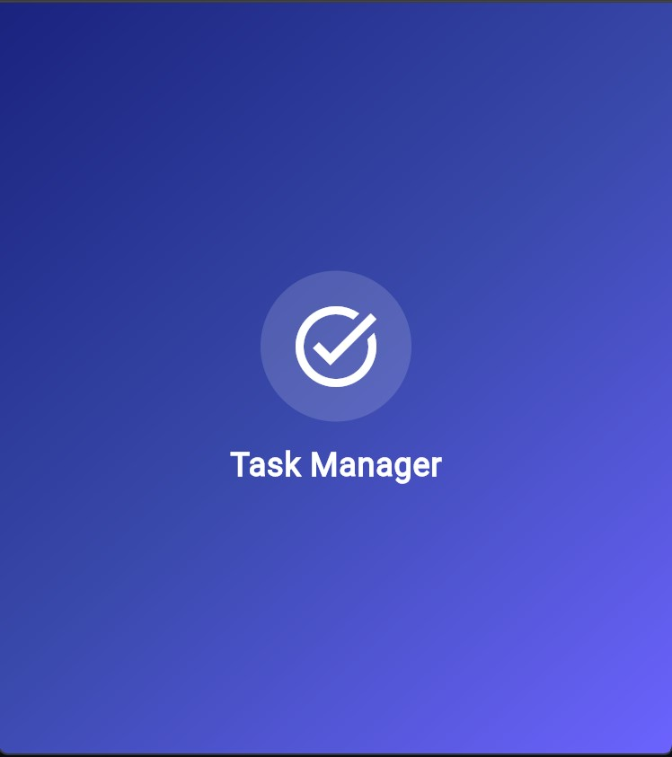
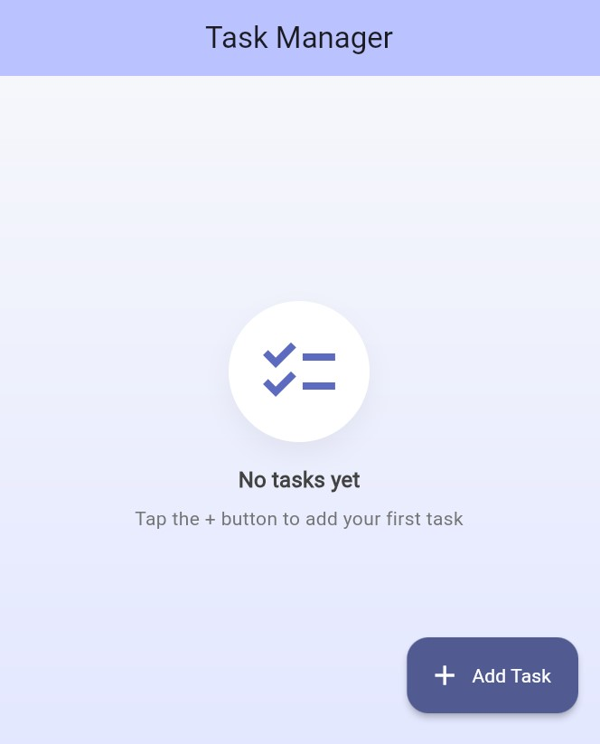

# Task Management App

A clean and simple Flutter task manager featuring add, complete, and delete actions with local persistence, a custom splash screen, and a polished UI.

## Features
- Add new tasks via a prominent Add button (FAB)
- Mark tasks complete with a checkbox (with strikethrough styling)
- Delete tasks via delete icon or swipe-to-delete
- Persistent storage using `shared_preferences`
- Splash screen with gradient and app icon
- Responsive UI and basic widget test coverage

## Tech Stack
- Flutter (Material 3)
- Dart 3
- Shared Preferences for local persistence

## Screenshots / Demo
-Screenshots here are added from when run on the project was run on  Chrome. Can run it on Moblie devices, web etc.




## Getting Started
### Prerequisites
- Flutter SDK installed (3.22+ recommended)
- Dart SDK matching the `environment` in `pubspec.yaml`
- Android Studio or Xcode for platform tooling

Verify your setup:
```sh
flutter doctor
```

### Install dependencies
```sh
flutter pub get
```

### Run the app
- List devices: `flutter devices`
- Run on a specific device (replace <device-id>):
```sh
flutter run -d <device-id>
```

## Platform Notes
### Android
- Enable a device or emulator from Android Studio
- Build release: `flutter build apk --release`

### iOS
- Requires macOS with Xcode
- Open `ios/Runner.xcworkspace` in Xcode
- Set Signing Team and a unique Bundle Identifier under Runner → Signing & Capabilities
- Connect your iPhone, enable Developer Mode (iOS 16+), and select it as the run destination
- Run from Xcode or via CLI: `flutter run -d <device-id>`

### Web
```sh
flutter run -d chrome
```

### Windows (Desktop)
```sh
flutter run -d windows
```

## Testing
```sh
flutter test
```
The included widget test validates basic UI flow (splash, add task, toggle complete).

## Project Structure
- `lib/main.dart`: App entry, splash, task list UI, persistence
- `test/widget_test.dart`: Basic widget test
- `pubspec.yaml`: Dependencies (`shared_preferences`, etc.)

## Data Persistence
Tasks are stored as a JSON-encoded list in `SharedPreferences` under the key `tasks_v1`. Uninstall the app or clear app storage to reset.

## Troubleshooting
- If build fails, run: `flutter clean && flutter pub get`
- Ensure you’re on a compatible Flutter version: `flutter --version`


